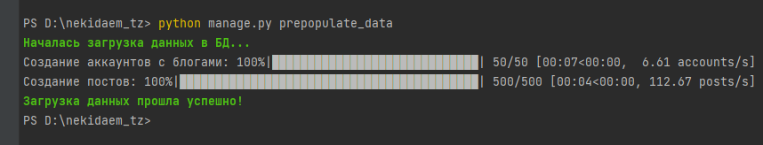
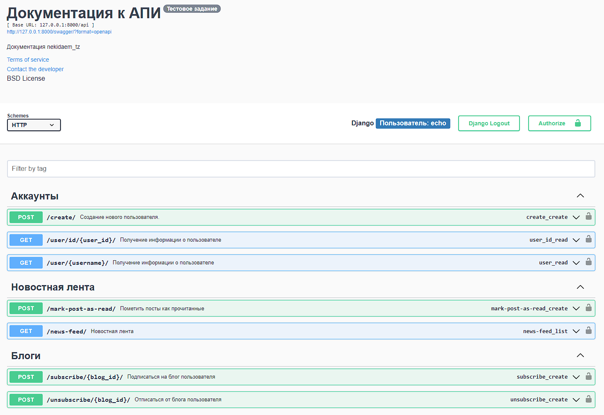
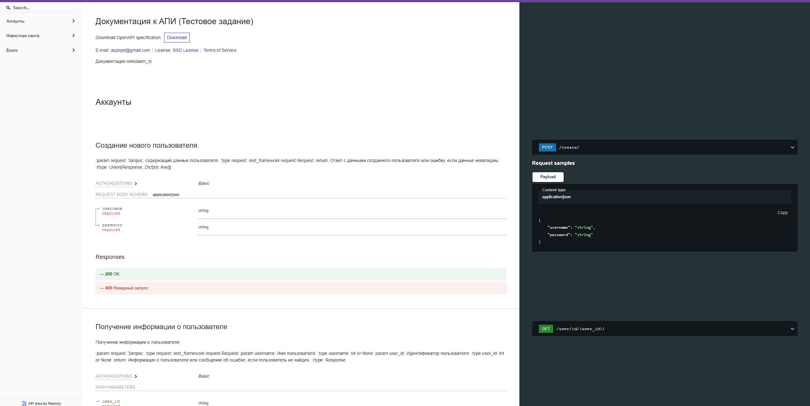

## Описание проекта

Реализован АПИ сервис по взаимодествию между пользовательскими блогами и постами. Основные функции, которые включает в себя:
- создание пользователей и блогов;
- подписка\отписка на блоги других пользователей;
- лента новостей;
- пометка постов в статус "Прочтен";
- периодические задачи на вывод в консоль последних 5 постов;
- менеджер по заполнению БД
- тестирование.

Настоящая инструкция предусматривает развертывание проекта в локальном сегменте и через docker

Для работы проекта потребуются:

- Python
- Django
- Postgresql
- DRF
- Celery

### Локальное развертывание проекта

1. Клонировать проект:
    ```
    git clone https://github.com/EchoFoe/nekidaem_tz.git
    ```
2. Создайте виртуальное окружение в корне проекта (зависит от вашей ОС) и установите зависимости
    ```
    pip install -r requirements.txt
    ```
3. Создайте БД (postgres), отредактируйте файл `.env` (использует python-dotenv) в корне проекта и укажите свои конфиги
    ```
    DB_NAME=your_db_name
    DB_USER=your_db_user
    DB_PASSWORD=your_db_pass
    DB_HOST=localhost
    DB_PORT=5432
    SECRET_KEY=your_django_secret_key
   ```
4. Создайте суперпользователя:
    ```
    python manage.py createsuperuser 
    ```
5. Произведите миграции:
    ```
    python manage.py migrate 
    ```
6. Заполните БД данными с помощью менеджера:
    ```
    python manage.py prepopulate_data 
    ```
Вы увидите что-то типа этого:



7. Запустить сервер разработки:
    ```
    python manage.py runserver 
    ```
8. Работу АПИ сервиса можно тестировать с помощью swagger http://127.0.0.1:8000/swagger/

9. Также можно ознакомиться с документацией http://127.0.0.1:8000/api/docs/

10. С помощью АПИ пожалуйста подпишитесь на блоги разных пользователей и присвойте статус к постам "Прочтен"
11. Запустите воркеры селери и селери-джанго-бит
    ```
    celery -A nekidaem_tz worker -l info
    celery -A nekidaem_tz beat -l info
    ```
13. Заведите через админку http://127.0.0.1:8000/admin/django_celery_beat/periodictask/ периодическую задачу `blogs.tasks.send_daily_newsletter` на вывод в консоль последних 5 постов для пользователей, которые имеют подписки. Вы увидите в консоли что-то типа этого:
   ```
   Ежедневная отправка для kaciabr:
   Последние посты:
   Пост Thing wide investment few easy increase increase. пользователя: echo
   Пост Quite away happen according heart. пользователя: echo
   Пост Idea scientist late animal same radio. пользователя: echo
   Пост Experience they own. пользователя: echo
   Пост Rich address despite must success suffer. пользователя: echo
   Ежедневная отправка для echo:
   Последние посты:
   Пост Current friend strong onto everyone. пользователя: kaciabr
   Пост Around kitchen keep tonight year respond. пользователя: echo2
   Пост White type power free reality. пользователя: echo2
   Пост Hotel account attack offer environment east state. пользователя: kaciabr
   Пост My give campaign both impact seat tend act. пользователя: kaciabr 
   ```

### Развертывание проекта с помощью Docker

1. Клонировать проект:
    ```
    git clone https://github.com/EchoFoe/nekidaem_tz.git
    ```
2. Отредактируйте файл `.env` (использует python-dotenv) в корне проекта и укажите свои конфиги
    ```
    DB_NAME=your_db_name
    DB_USER=your_db_user
    DB_PASSWORD=your_db_pass
    DB_HOST=localhost
    DB_PORT=5432
    SECRET_KEY=your_django_secret_key
   ```
3. Поднять Dockerfile:
    ```
    docker-compose up
    ```
Это запустит все сервисы, включая Django-приложение, базу данных PostgreSQL, сервер Redis и сервисы Celery для выполнения периодических задач. Не забудьте залить в БД данные с помощью менеджера `blogs.tasks.send_daily_newsletter`, указать периодическую задачу в админке приложения.